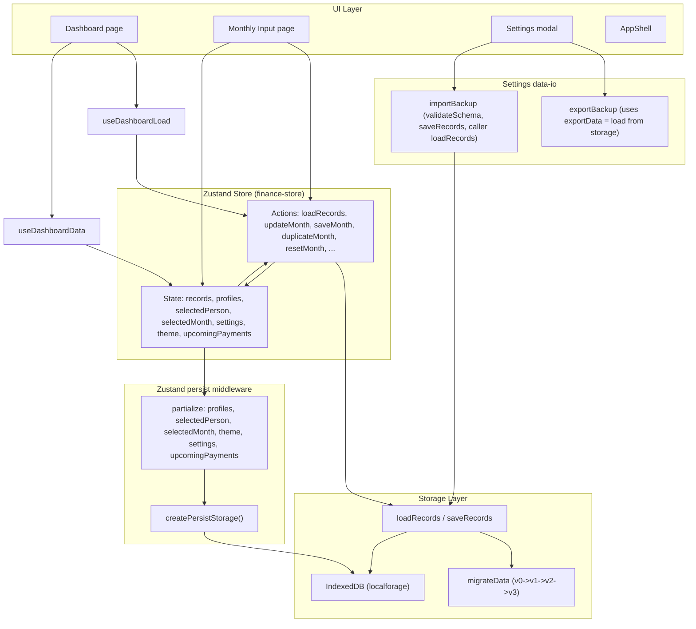

# Finance Dashboard — Deep Technical Audit

## Executive Summary

**App purpose (from README/DEVELOPMENT_PLAN):** Local-only finance dashboard (Next.js 14+, React, TypeScript). Data in IndexedDB via localforage; Zustand for state; no backend, no auth. Features: Monthly Input (autosave, duplicate/reset month), Dashboard (metrics, charts, history, profile/currency selectors), Settings (net cashflow toggle, profiles, backup/import, clear data).

**Overall readiness score: 62%**

**Go / No-Go: No-Go.** Critical issues must be fixed before production: debug/agent network calls in four files, a store bug when removing the selected profile, and a render-side effect on the dashboard page. Major risks (race conditions on save, export vs in-memory semantics, validation gaps) and minor issues (redundant loads, performance notes) should be addressed in order.

---

## Critical Issues (Must Fix)

1. **Debug/agent logging to external URL (security and correctness)**  
   Four files contain `#region agent log` blocks that `fetch("http://127.0.0.1:7242/ingest/...")` and send internal state (e.g. `recordsLength`, `selectedMonth`, `error`).  
   - **Files:** [lib/store/finance-store.ts](lib/store/finance-store.ts), [lib/storage/storage.ts](lib/storage/storage.ts), [lib/dashboard/useDashboardData.ts](lib/dashboard/useDashboardData.ts), [app/page.tsx](app/page.tsx).  
   - **Impact:** In production, requests fail (no local server); every load/save/render can trigger fetches; potential data leakage if URL were ever pointed elsewhere.  
   - **Fix:** Remove all `#region agent log` blocks and the associated `fetch(...)` calls.

2. **`removeProfile` leaves `selectedPerson` pointing at removed profile**  
   In [lib/store/finance-store.ts](lib/store/finance-store.ts), when the selected profile is removed, `selectedPerson` is set to `state.profiles[0]?.id` (the **current** list). After `set()`, `profiles` becomes the filtered list, so if you remove the first profile (e.g. "me"), `selectedPerson` is still `"me"` while `profiles` no longer contains "me".  
   - **Fix:** When `state.selectedPerson === id`, set `selectedPerson` to the first profile in the **new** list:  
     `const nextProfiles = state.profiles.filter((p) => p.id !== id);`  
     `selectedPerson: state.selectedPerson === id ? (nextProfiles[0]?.id ?? "me") : state.selectedPerson`

3. **Side effect during render (Dashboard)**  
   In [app/page.tsx](app/page.tsx), a `fetch("http://127.0.0.1:7242/...")` runs in the render path (no `useEffect`). This violates React rules and can cause inconsistent UI / double invocations in Strict Mode.  
   - **Fix:** Remove the block (same as item 1); do not add a replacement side effect in render.

---

## Major Risks (High Priority)

4. **Race condition on autosave**  
   `updateMonth`, `updateMonthFull`, `duplicateMonth`, `resetMonth` call `saveRecords(records).catch(...)` without awaiting. Rapid successive edits (or duplicate + edit) can enqueue multiple writes; completion order is not guaranteed, so the last persisted state might not match the last user action.  
   - **Mitigation:** Serialize writes (e.g. single in-flight save promise, or queue and process one at a time) and/or debounce at the storage layer so only the latest state is written after activity settles.

5. **Export reflects storage, not current UI state**  
   [lib/settings/data-io.ts](lib/settings/data-io.ts) `exportBackup` uses `exportData()` which calls `loadRecords()` from storage. If the user has unsaved changes in the Monthly Input (only in store, not yet flushed to IndexedDB), the downloaded backup does not include those edits.  
   - **Risk:** User assumes "Export" = "what I see"; restores later and loses in-memory edits.  
   - **Mitigation:** Either export from store (e.g. `useFinanceStore.getState().records`) after flushing pending autosave, or document clearly that export is "last persisted state" and add a "Save all" before export.

6. **Zod `meta.updatedAt` with `z.string().datetime()`**  
   [lib/validation/schemas.ts](lib/validation/schemas.ts) uses `z.string().datetime()` (ISO 8601). JavaScript `Date().toISOString()` produces that, but migrated or hand-edited JSON might have dates without the "Z" or with a different format and fail validation.  
   - **Mitigation:** Keep schema strict for new data; in migrations/import, coerce or normalize date strings before validation, or use a looser schema for legacy `updatedAt` and normalize on read.

7. **No storage check before critical actions**  
   If IndexedDB/localStorage is unavailable (e.g. private mode, quota, disabled), `getStorage()` throws. `loadRecords` and `createPersistStorage` handle it, but the app does not proactively warn the user that "saves may not persist" when storage is unavailable.  
   - **Mitigation:** On app init (e.g. in AppShell or after first load attempt), call `isStorageAvailable()` and show a persistent banner when false so the user knows data is not persisted.

8. **Exchange rate API dependency**  
   [lib/utils/currency.ts](lib/utils/currency.ts) uses `https://api.frankfurter.app/latest?from=RON&to=USD,EUR`. Failure is handled (returns null, display falls back to RON), but there is no retry, no caching beyond in-memory state, and no guarantee that Frankfurter will remain available or free.  
   - **Risk:** External dependency for display-only feature; if it changes or is blocked, USD/EUR display degrades gracefully but with no user feedback.  
   - **Mitigation:** Optional: retry once, show "Rates unavailable" in header when null; document dependency and consider a simple fallback (e.g. static last-known rates in env).

---

## Minor Issues (Nice to Fix)

9. **Redundant `loadRecords()` on every route**  
   Both Dashboard (via `useDashboardLoad`) and Monthly Input call `loadRecords()` in `useEffect` on mount. Navigating between them triggers repeated loads. Not wrong, but redundant.  
   - **Improvement:** Call `loadRecords()` once in a top-level provider or AppShell after rehydration (e.g. in a `useEffect` that runs once when the app mounts), and remove per-page load effects (or guard with "only if records are empty or stale").

10. **`getLast12Months` / `getLast6Months` sort on every call**  
   [lib/store/finance-store.ts](lib/store/finance-store.ts) sorts `state.records` by month on each invocation. For large record sets this is O(n log n) per call.  
   - **Improvement:** Keep records sorted on insert (e.g. in `upsertRecord` or when setting state), or memoize sorted slice in a selector/hook.

11. **Dashboard page: `fetch` in render**  
   Already covered by Critical #3; removal of the agent log fixes this.

12. **`parseRON` allows minus sign**  
   [lib/utils/currency.ts](lib/utils/currency.ts) `parseRON` keeps `-` in the regex. If a user types a minus, the value can be negative; schema and UI assume non-negative. Save validation would eventually reject invalid data, but the form could show negative values until then.  
   - **Improvement:** Clamp to >= 0 in the input layer or in `parseRON` when used for category amounts.

13. **Error boundary does not log to a service**  
   [components/shared/ErrorBoundary.tsx](components/shared/ErrorBoundary.tsx) uses `logError` (console). For production, consider reporting to an error service (e.g. Sentry) so you can detect regressions.

---

## Missing Components / Gaps

14. **Header search, calendar, notifications**  
   README states these are "UI-only placeholders (no behavior yet)." So they are intentionally incomplete; document or hide until implemented.

15. **No explicit "Save all" or "Flush autosave" before export**  
   Export uses storage, not store; see Major #5. A single "Save all" or "Export current view (including unsaved)" would clarify behavior.

16. **Virtualization for history**  
   DEVELOPMENT_PLAN mentions "If history grows > 50 items, add virtualization (react-window)." Not implemented; acceptable for current scale but should be revisited if users have many years of data.

17. **No E2E coverage for import/export or clear data**  
   E2E exists for dashboard, monthly-input, navigation, settings ([e2e/](e2e)); no tests for backup import, export, or "Clear all data" flow. Adding at least one happy-path E2E for import/export would reduce regression risk.

---

## Architecture Diagram (Textual)

**Data flow (short):** UI reads from and dispatches to Zustand. Records are loaded from IndexedDB via `loadRecords()` on page mount; writes go through `saveRecords(records)` (fire-and-forget for autosave). Persist middleware writes only UI/preferences to the same IndexedDB store; `records` are not in partialize and are loaded separately. Export reads from storage (not store); import writes to storage then caller calls `loadRecords()` and optionally `setProfiles()`.

---

## Improvement Roadmap

1. **Must do before production**  
   - Remove all debug/agent `fetch` blocks from [finance-store.ts](lib/store/finance-store.ts), [storage.ts](lib/storage/storage.ts), [useDashboardData.ts](lib/dashboard/useDashboardData.ts), [app/page.tsx](app/page.tsx).  
   - Fix `removeProfile` so `selectedPerson` is set to `nextProfiles[0]?.id ?? "me"` when removing the selected profile.

2. **High priority**  
   - Introduce serialized or debounced write path for `saveRecords` so rapid updates cannot reorder persists.  
   - Clarify or change export semantics: either export from store (after flush) or document "export = last persisted state" and add "Save all" before export.  
   - On init, if `!isStorageAvailable()`, show a non-dismissible or prominent banner that data will not be saved.

3. **Next**  
   - Consolidate `loadRecords()` to a single app-level init (e.g. AppShell) and remove duplicate calls from Dashboard and Monthly Input.  
   - Optional: retry and user-visible message for exchange rate fetch; document Frankfurter dependency.  
   - Normalize or relax `updatedAt` in migrations/import if you need to support non-ISO dates.

4. **Ongoing**  
   - Add E2E for import/export (and optionally "Clear all data").  
   - Consider keeping `records` sorted or memoizing sorted slices.  
   - Clamp or reject negative values in currency input for category amounts.  
   - When adding production error reporting, plug ErrorBoundary into it.

---

## Summary Table

| Category            | Count | Examples |
|---------------------|-------|----------|
| Critical            | 3     | Agent fetch in 4 files; removeProfile bug; fetch in render |
| Major               | 5     | Save race; export vs store; datetime validation; storage banner; exchange API |
| Minor               | 5     | Redundant loadRecords; sort on every get; parseRON minus; error reporting |
| Missing / gaps      | 4     | Search/calendar/notifications placeholders; export semantics; virtualization; E2E for backup |

**Constraints respected:** No full rewrite; no extra abstractions; fixes are minimal and high-impact where possible.
