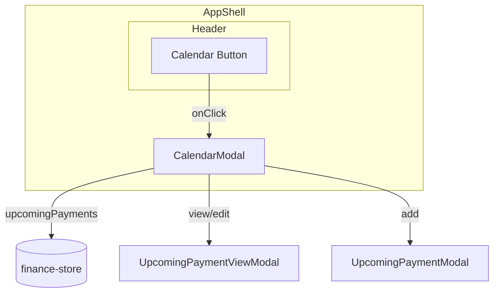

# Calendar Button - Yearly View Implementation

## Current State

- **Header.tsx** (`components/layout/Header.tsx`, lines 115–122): Calendar button exists but has no `onClick` handler
- **Upcoming Payments**: Stored in `finance-store` as `upcomingPayments`, displayed in `RightSidebar.tsx`
- **Design system**: `glass-panel`, `glass-surface`, design tokens, Poppins font, Romanian locale (`date-fns` ro)
- **Existing patterns**: `MonthPicker.tsx` uses Dialog + Calendar; `UpcomingPaymentViewModal` for payment details

## Architecture

## Implementation Plan

### 1. Create `CalendarModal` component

**File:** `components/shared/CalendarModal.tsx`

- **Trigger**: Controlled by `open` / `onOpenChange` props (same pattern as SettingsModal).
- **Layout**:
  - Header: title "Calendar", year selector (ChevronLeft / ChevronRight), optional close
  - 12-month grid: 3 columns × 4 rows (or 4×3) on desktop, 2×6 on smaller screens
  - Each month cell: month name, mini day grid (7 columns for weekdays), dots/counts on days with payments
  - Bottom section: scrollable list of all Upcoming Payments (same structure as RightSidebar)

- **Data flow**: `useFinanceStore(s => s.upcomingPayments)`; group by month/year; map to day cells.
- **Apple-style styling**:
  - Generous padding and spacing
  - Light borders, subtle shadows
  - Monochrome base with accent for selected/today
  - Minimal decoration (no heavy frames)
  - `glass-panel-elevated` for the modal content

- **Interactions**:
  - Click payment row → open `UpcomingPaymentViewModal`
  - "+" button → open `UpcomingPaymentModal` (add)
  - Edit from view modal reuses existing flow

### 2. Yearly month grid design

- **Year**: State `year` (number), defaults to current year; prev/next buttons.
- **Month cells**: Use `getMonthsForYear(year)` from `lib/utils/date.ts` (lines 94–103).
- **Per month**: Mini grid (Lu–Du weekdays, ~6 rows of days). For each day, check if any `upcomingPayments` has `date` matching that day; show small dot or count.
- **Today**: Highlight current date with `accentPrimary` or subtle border.

### 3. Integrate with Header and AppShell

- **Header**: Add `onOpenCalendar` callback; wire Calendar button `onClick` to it.
- **AppShell**: Add `CalendarModal` state (`calendarOpen`), pass `onOpenCalendar` to Header, render `CalendarModal` with `open={calendarOpen}` and `onOpenChange`.

### 4. Reuse existing components

- `UpcomingPaymentModal` for add/edit
- `UpcomingPaymentViewModal` for view
- `getUpcomingPaymentIcon`, `formatCurrency`, date formatting from `date-fns` + `ro` locale

## File Changes Summary

| File | Action |
|------|--------|
| `components/shared/CalendarModal.tsx` | **Create** – main calendar modal with yearly grid + payments list |
| `components/layout/Header.tsx` | Add `onOpenCalendar` prop, wire Calendar button |
| `components/layout/AppShell.tsx` | Add calendar state, render `CalendarModal`, pass handler to Header |

## Suggested Additional Features

1. **Year quick-jump** – Small dropdown or clickable year label to type/jump to a year (e.g. 2024, 2026).
2. **Monthly total** – Show total amount due per month in each cell (e.g. "1,500 RON" under the mini grid).
3. **Today indicator** – Clear visual highlight for today's date.
4. **Empty state** – Friendly message when there are no upcoming payments (e.g. "No upcoming payments").
5. **Quick-add** – "+" button in calendar modal to add a payment without leaving the view.

These can be added in a follow-up if you want to keep the first iteration smaller.
